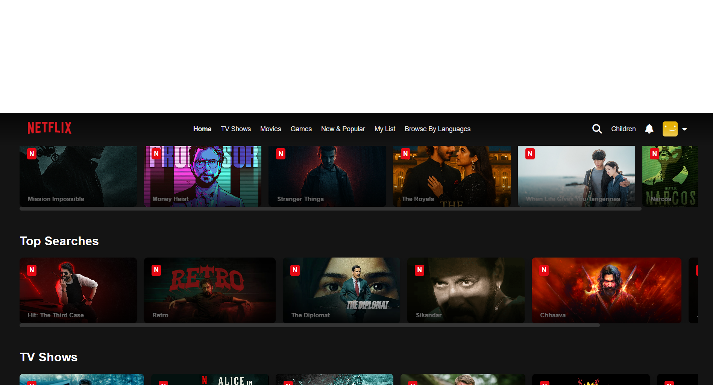
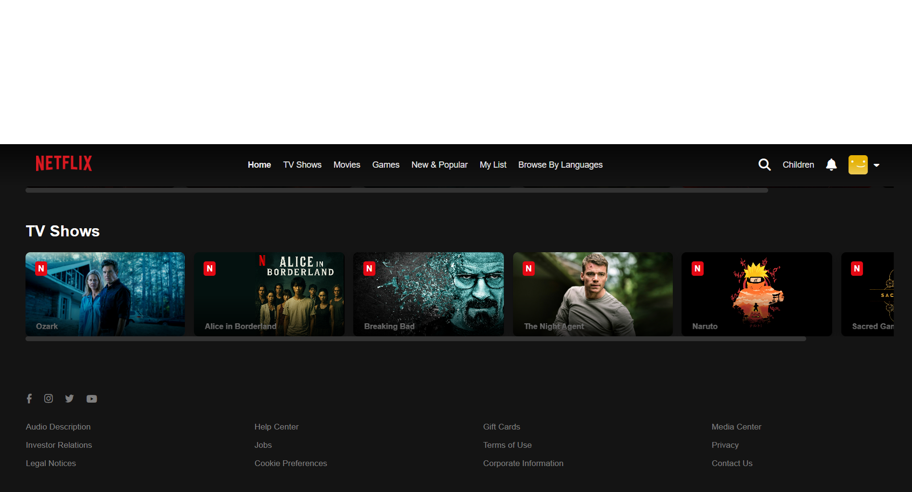
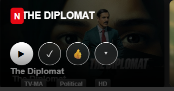
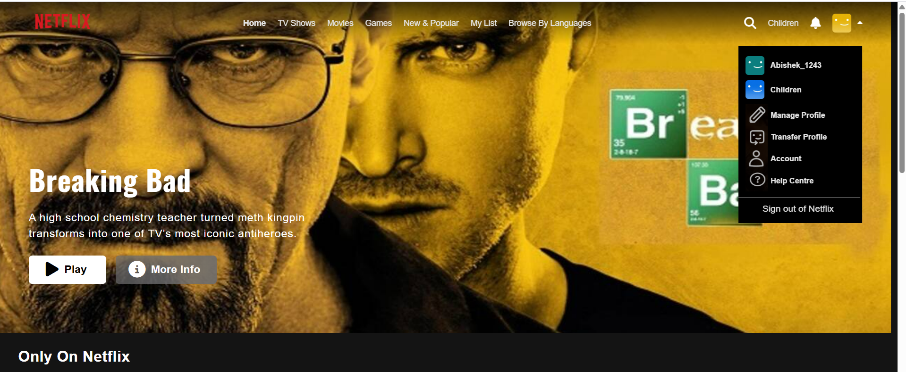
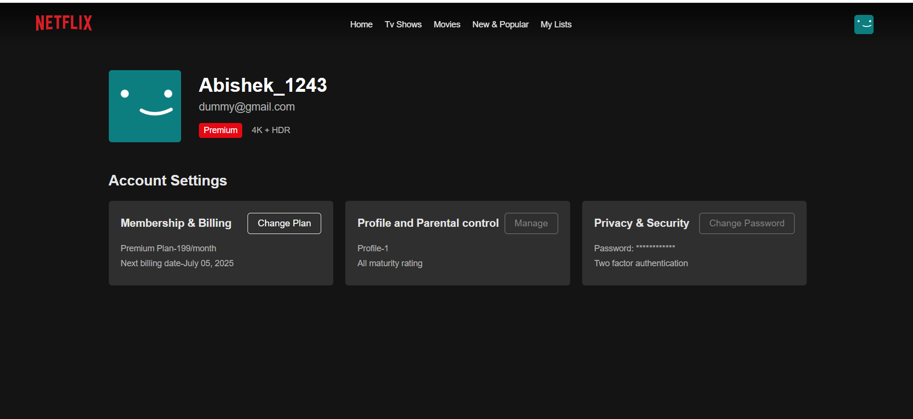

# 📺 Netflix Clone

A responsive and interactive clone of Netflix’s UI built with HTML, CSS, and JavaScript. This project replicates the look, feel, and structure of the real Netflix web app, including interactive content sections, navigation bar, overlays, and profile switching experience.

---

## 🚀 Features

- ✅ Fully responsive layout
- ✅ Navbar with dropdown and icons
- ✅ Hero section with featured content
- ✅ Multiple content sections like:
  - *Only on Netflix*
  - *Top Searches*
  - *TV Shows*
- ✅ Overlay animation with play, like, info buttons
- ✅ Profile dropdown like original Netflix
- ✅ Custom JS tooltips/descriptions for each card
- ✅ FontAwesome icons integrated
- ✅ Clean, modular CSS for scalability

---

## 📁 Folder Structure

NETFLIX_CLONE/
│
├── assets/ # All images and icons
│ ├── missionimpossible.jpg
│ ├── narcos.jpg
│ ├── ...
│
├── index.html # Main HTML file
├── styles.css # Core styling
├── app.js # Interaction logic
└── README.md # This file

yaml
Copy
Edit

---

## 🛠️ Technologies Used

- **HTML5**  
- **CSS3**  
- **JavaScript (ES6)**  
- **Font Awesome** (CDN)

---

## 📸 Screenshots

<<<<<<< HEAD
### 🏠 1. Home Page

### 🎞️ 2. Content Row (Card Section)

### 📩 3. Footer Section

### 🖱️ 4. Card Hover Interaction

### 👤 5. Profile Icon Hover (Down Bar)

### 📄 6. Page Navigation / New Page View

=======
> (assets/one.png)
>>>>>>> 549c6fb03775d752749abf00270507d0f86a965c

---

## 🧠 How It Works

- JS assigns `window.id` variables to store hover descriptions.
- `mouseover` and `click` events can trigger dynamic overlays or tooltips (based on app.js).
- All content cards are uniquely identified with 2-letter IDs for clean targeting.

---

## 🧑‍💻 Developer

- **Name:** Abishek  
- **GitHub:** [Abishekvit](https://github.com/Abishekvit)

---

## 📌 Future Enhancements

- [ ] Add backend authentication (Firebase/Auth0)
- [ ] Add video previews on hover (like real Netflix)
- [ ] Integrate with real movie API (TMDb)
- [ ] Dark/light theme toggle
- [ ] Profile creation & switching logic

---

## 📃 License

This project is for educational and demo purposes only. It is **not** affiliated with or endorsed by Netflix Inc.
