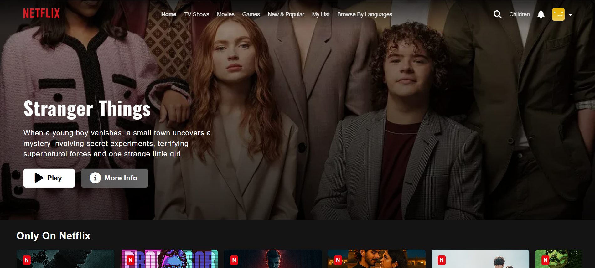
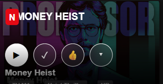
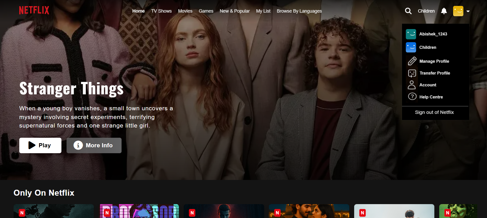

# Netflix Clone

A responsive and interactive clone of Netflix’s UI built with HTML, CSS, and JavaScript. This project replicates the look, feel, and structure of the real Netflix web app, including interactive content sections, navigation bar, overlays, and profile switching experience.

---

## Features

-  Fully responsive layout
-  Navbar with dropdown and icons
-  Hero section with featured content
-  Multiple content sections like:
  - *Only on Netflix*
  - *Top Searches*
  - *TV Shows*
-  Overlay animation with play, like, info buttons
-  Profile dropdown like original Netflix
-  Custom JS tooltips/descriptions for each card
-  FontAwesome icons integrated
-  Clean, modular CSS for scalability

---

## 📁 Folder Structure
```
NETFLIX_CLONE/
│
├── assets/                  # All images and icons
│   ├── missionimpossible.jpg
│   ├── narcos.jpg
│   └── ...
│
├── index.html               # Main HTML file (home page)
├── styles.css               # Core styling for homepage
├── profile-details.html     # Profile details redirect page
├── profile-details.css      # Styling for profile details
├── app.js                   # JavaScript logic for interactions
└── README.md                # Project documentation
```

---

## Technologies Used

- **HTML5**  
- **CSS3**  
- **JavaScript (ES6)**  
- **Font Awesome** (CDN)
---

## 📸 Screenshots

###  1. Home Page


###  2. Content Row (Card Section)


###  3. Footer Section


###  4. Card Hover Interaction


###  5. Profile Icon Hover (Down Bar)


###  6. Page Navigation / New Page View


###  7. Home Page Half viewport


###  8. New Page Half viewport

---

## How It Works

- JS assigns `window.id` variables to store hover descriptions.
- `mouseover` and `click` events can trigger dynamic overlays or tooltips (based on app.js).
- All content cards are uniquely identified with 2-letter IDs for clean targeting.

---

## Key UI Features

- **Dynamic Header Background**  
  - Black background by default.  
  - Adapts to main background when fully scrolled.

- **Interactive Hover Effects**  
  - All clickable elements (links, icons, etc.) show reduced opacity on hover for visual feedback.

- **Profile Dropdown Menu**  
  - Hovering on the profile icon reveals a dropdown (downbar) with profile options.  
  - Clicking on **Account** or the **profile icon** redirects to the **Profile Details Page**.

- **Card Hover Interactions**  
  - Hovering over a movie card shows:  
    - Control buttons (Play, Like, Info, etc.)  
    - Movie genre/type  
    - Movie name  
    - Netflix badge overlay

- **Horizontal Scrollable Rows**  
  - Content rows (e.g., *Top Searches*, *Only on Netflix*) use `overflow-x` to enable horizontal scrolling.

- **Mobile Responsive Design**  
  - Media queries applied for optimal viewing across mobile, tablet, and desktop devices.

- **Card Click Behaviour**  
  - Clicking on a card scrolls the page to top and displays the selected movie’s details in the home layout.

---

##  Developer

- **Name:** Abishek  
- **GitHub:** [Abishekvit](https://github.com/Abishekvit)

---

##  Future Enhancements

- [ ] Add backend authentication (Firebase/Auth0)
- [ ] Add video previews on hover (like real Netflix)
- [ ] Integrate with real movie API (TMDb)
- [ ] Dark/light theme toggle
- [ ] Profile creation & switching logic

---

## License

This project is for educational and demo purposes only. It is **not** affiliated with or endorsed by Netflix Inc.
